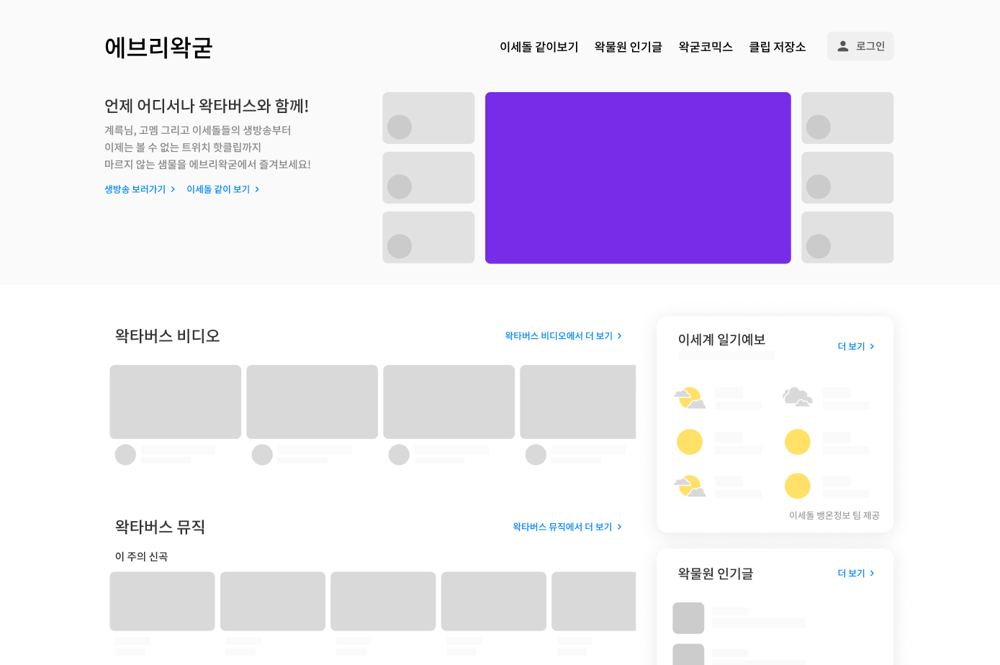

# everywak-frontend

ReactJS로 구현된 에브리왁굳 프론트엔드

## 에브리왁굳이란?

[에브리왁굳](https://beta.everywak.kr/)은 스트리머 [우왁굳](https://www.youtube.com/@woowakgood)과 왁타버스와 관련된 컨텐츠를 제공하는 팬사이트입니다.

 

## 주요 컨텐츠

### [왁물원](https://cafe.naver.com/steamindiegame)[1](#footnote_1) 인기글 목록 및 검색 - [바로가기](https://beta.everywak.kr/bestwakki)

오래되었거나 상대적으로 인기도가 떨어져 목록에서 사라져버린 인기글을 한 눈에 확인할 수 있습니다.\
또한 다시 보고 싶은 글을 찾아보기 쉽도록 제목/게시판/작성자 닉네임을 통한 검색 기능도 제공합니다.

### 왁타버스 생방송 멀티뷰 - [바로가기](https://beta.everywak.kr/withlive)

이세계아이돌, 고정 멤버 등 모든 왁타버스 멤버들의 방송을 동시에 시청할 수 있습니다.\
채팅 콜렉터, 멀티 채팅창, 채팅창 팝업 등 아프리카TV보다 앞선 기능으로 편안한 시청 경험을 제공합니다.

### 왁타버스 웹툰 플랫폼 - [바로가기](https://beta.everywak.kr/waktoon)

왁물원에 올라오는 인기 팬웹툰들을 모아 정리해서 감상하기 쉽게 만들었습니다.\
연재되는 작품들을 에피소드별로 찾아보거나 하루동안 좋아요를 많이 받은 작품들을 순위표로 보여줍니다.

### 이세돌 뱅온정보 - [바로가기](https://beta.everywak.kr/weather)

이세계 아이돌 멤버들의 생방송 정보를 일기예보 형식으로 보여줍니다.

 

## 빌드 관련 명령어

프로젝트 디렉토리로 들어간 뒤, 다음과 같은 명령어를 사용할 수 있습니다:

### `yarn install`

`package.json` 의 패키지들을 설치합니다.

### `yarn dev`

앱을 개발 모드로 실행합니다.\
[https://localhost:3000](https://localhost:3000)로 접속하면 결과물을 바로 확인할 수 있으며 변경 사항이 실시간으로 반영됩니다.

### `yarn build`

앱을 최적화된 형태로 빌드하여 `dist` 폴더로 출력합니다.

## 라이센스

다음의 행위는 허용됩니다.

- 허용되지 않는 행위를 제외하고, 누구나 본 프로젝트의 소스 코드 중 일부 또는 전체를 사용, 수정 및 재배포할 수 있습니다. 단, 누구나 접근 가능한 곳에 원작자(@wei756) 크레딧을 명시해야 합니다.

다음의 행위는 허용하지 않습니다.

- 원작자의 동의 없이 본 프로젝트의 소스 코드 중 일부 또는 전체를 사용하여 에브리왁굳(everywak.kr)과 혼동의 여지가 있는 프로그램 또는 웹사이트를 제작 및 운영하는 경우.

- 원작자의 동의 없이 본 프로젝트에서 제공하는 컨텐츠와 유사한 기능을 제공하는 웹사이트를 운영할 목적으로 본 프로젝트의 소스 코드 중 일부 또는 전체를 활용하는 경우. 본 프로젝트에서 제공하는 컨텐츠는 다음과 같습니다.

- - 한 화면에서 다수의 생방송 스트림과 실시간 채팅을 동시에 시청할 수 있는 서비스

- - 커뮤니티의 게시글 목록을 크롤링하고 목록화한 결과를 재가공하여 보여주는 서비스

- 본 프로젝트의 소스 코드 중 일부 또는 전체를 사용한 모든 경우의 상업적 행위. 본 프로젝트에는 상업적 사용이 금지된 리소스 또는 스크립트가 포함되어 있으며, 이를 무단으로 이용함으로써 발생할 수 있는 법적 책임은 모두 사용한 자에게 있습니다.

## 오픈소스 라이센스

- `react`
  `axios`
  `mui`
  `sass`
  `emotion`
  `classnames`
  `crypto-js`
  `framer-motion`
  `lodash`
  `react-query`
  `react-cookie`
  `react-ga`
  `react-microsoft-clarity`
  `react-responsive`
  `vite`

## 주석

<a name="footnote_1">1</a>: 우왁굳 공식 팬카페
